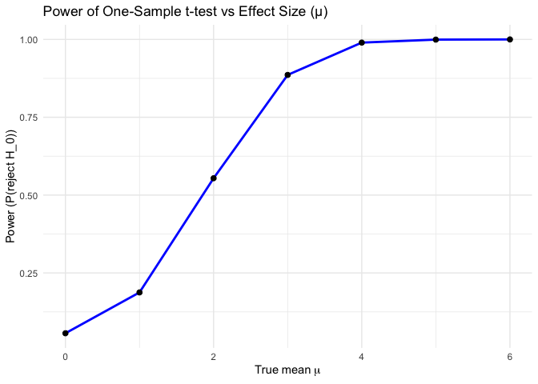
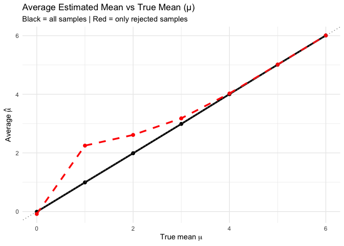

hw5_vy2196
================

``` r
library(tidyverse)
```

    ## ── Attaching core tidyverse packages ──────────────────────── tidyverse 2.0.0 ──
    ## ✔ dplyr     1.1.4     ✔ readr     2.1.5
    ## ✔ forcats   1.0.1     ✔ stringr   1.5.1
    ## ✔ ggplot2   3.5.2     ✔ tibble    3.3.0
    ## ✔ lubridate 1.9.4     ✔ tidyr     1.3.1
    ## ✔ purrr     1.1.0     
    ## ── Conflicts ────────────────────────────────────────── tidyverse_conflicts() ──
    ## ✖ dplyr::filter() masks stats::filter()
    ## ✖ dplyr::lag()    masks stats::lag()
    ## ℹ Use the conflicted package (<http://conflicted.r-lib.org/>) to force all conflicts to become errors

``` r
library(rvest)
```

    ## 
    ## Attaching package: 'rvest'
    ## 
    ## The following object is masked from 'package:readr':
    ## 
    ##     guess_encoding

### Problem 1

``` r
# Function to check if at least two people share a birthday
share_birthday = function(n) {
  birthdays = sample(1:365, n, replace = TRUE)  # randomly assign birthdays
  return(length(unique(birthdays)) < n)          
}

set.seed(1)
n_sim = 10000 # number of simulations per group size

group_sizes = 2:50
prob_shared = numeric(length(group_sizes))

for (i in seq_along(group_sizes)) {
  n = group_sizes[i]
  results = replicate(n_sim, share_birthday(n))
  prob_shared[i] = mean(results)   # proportion of TRUE results
}
```

``` r
#making a plot
sim_results = tibble(
  n = 2:50,
  prob = map_dbl(n, ~ mean(replicate(10000, share_birthday(.x))))
)

ggplot(sim_results, aes(x = n, y = prob)) +
  geom_line(color = "blue") +
  geom_point(color = "darkblue") +
  geom_hline(yintercept = 0.5, linetype = "dashed", color = "red") +
  labs(title = "Probability of Shared Birthday vs Group Size",
       x = "Group Size",
       y = "Probability of Shared Birthday") +
  theme_minimal()
```

<!-- --> The
probability is around 50% when the group size is about 23 people, and it
reaches 100% when the group size is about 50 people.

### Problem 2

``` r
library(broom)

n = 30
sigma = 5
mu_values = 0:6
n_sim = 5000

simulate_ttest = function(mu, n = 30, sigma = 5) {
  x = rnorm(n, mean = mu, sd = sigma)
  t_res = t.test(x, mu = 0)
  
  # Clean the t-test output using broom::tidy
  broom::tidy(t_res) |>
    select(estimate, p.value) |>  # keep only needed columns
    mutate(true_mu = mu)}


# Run simulations for each mu
sim_results = map_df(mu_values, function(mu) {
  replicate(n_sim, simulate_ttest(mu, n, sigma), simplify = FALSE) |>
    bind_rows()})
```

``` r
#Compute power 
power_results = sim_results |>
  group_by(true_mu) |>
  summarise(power = mean(p.value < 0.05))

# Plot Power vs Effect Size 
ggplot(power_results, aes(x = true_mu, y = power)) +
  geom_line(color = "blue", size = 1) +
  geom_point(size = 2) +
  labs(
    title = "Power of One-Sample t-test vs Effect Size (μ)",
    x = expression(True~mean~mu),
    y = "Power (P(reject H_0))"
  ) +
  theme_minimal()
```

    ## Warning: Using `size` aesthetic for lines was deprecated in ggplot2 3.4.0.
    ## ℹ Please use `linewidth` instead.
    ## This warning is displayed once every 8 hours.
    ## Call `lifecycle::last_lifecycle_warnings()` to see where this warning was
    ## generated.

<!-- --> As the
true mean increases, the power of the test also increases. This means
when the true mean is close to 0, the test rarely rejects null
hypothesis. As the true mean increases, the difference between the
sample mean and the hypothesized mean becomes easier to detect, so the
test rejects the null hypothesis more often.

``` r
# Average estimated μ 
mu_summary <- sim_results |>
  group_by(true_mu) |>
  summarise(
    avg_estimate_all = mean(estimate),
    avg_estimate_rejected = mean(estimate[p.value < 0.05])
  )

# Plot Average Estimates 
ggplot(mu_summary, aes(x = true_mu)) +
  geom_line(aes(y = avg_estimate_all), color = "black", size = 1.2) +
  geom_point(aes(y = avg_estimate_all), color = "black", size = 2) +
  geom_line(aes(y = avg_estimate_rejected), color = "red", size = 1.2, linetype = "dashed") +
  geom_point(aes(y = avg_estimate_rejected), color = "red", size = 2) +
  geom_abline(slope = 1, intercept = 0, color = "gray50", linetype = "dotted") +
  labs(
    title = "Average Estimated Mean vs True Mean (μ)",
    subtitle = "Black = all samples | Red = only rejected samples",
    x = expression(True~mean~mu),
    y = expression(Average~hat(mu))
  ) +
  theme_minimal()
```

<!-- -->

The sample average of 𝜇̂ across tests for which the null is rejected
approximately equal to the average estimate of 𝜇̂ when the true mean is
greater than or equal to 4. The red line peaks at 1 because that’s where
the most extreme 5% of all the samples are, which shows extreme bias.
And it slowly merges with the black line when true mean is 4 or more
since more and more samples are significant

### Problem 3

``` r
library(purrr)
```

``` r
homicides = read_csv("https://raw.githubusercontent.com/washingtonpost/data-homicides/master/homicide-data.csv")
```

    ## Rows: 52179 Columns: 12
    ## ── Column specification ────────────────────────────────────────────────────────
    ## Delimiter: ","
    ## chr (9): uid, victim_last, victim_first, victim_race, victim_age, victim_sex...
    ## dbl (3): reported_date, lat, lon
    ## 
    ## ℹ Use `spec()` to retrieve the full column specification for this data.
    ## ℹ Specify the column types or set `show_col_types = FALSE` to quiet this message.

``` r
glimpse(homicides)
```

    ## Rows: 52,179
    ## Columns: 12
    ## $ uid           <chr> "Alb-000001", "Alb-000002", "Alb-000003", "Alb-000004", …
    ## $ reported_date <dbl> 20100504, 20100216, 20100601, 20100101, 20100102, 201001…
    ## $ victim_last   <chr> "GARCIA", "MONTOYA", "SATTERFIELD", "MENDIOLA", "MULA", …
    ## $ victim_first  <chr> "JUAN", "CAMERON", "VIVIANA", "CARLOS", "VIVIAN", "GERAL…
    ## $ victim_race   <chr> "Hispanic", "Hispanic", "White", "Hispanic", "White", "W…
    ## $ victim_age    <chr> "78", "17", "15", "32", "72", "91", "52", "52", "56", "4…
    ## $ victim_sex    <chr> "Male", "Male", "Female", "Male", "Female", "Female", "M…
    ## $ city          <chr> "Albuquerque", "Albuquerque", "Albuquerque", "Albuquerqu…
    ## $ state         <chr> "NM", "NM", "NM", "NM", "NM", "NM", "NM", "NM", "NM", "N…
    ## $ lat           <dbl> 35.09579, 35.05681, 35.08609, 35.07849, 35.13036, 35.151…
    ## $ lon           <dbl> -106.5386, -106.7153, -106.6956, -106.5561, -106.5810, -…
    ## $ disposition   <chr> "Closed without arrest", "Closed by arrest", "Closed wit…

The raw data includes `uid` which is specific case id for specific city,
information about the victim such as first and last name, gender, city,
state, and the disposition.

``` r
city_summary = homicides |>
  mutate(city_state = paste(city, state, sep = ", ")) |>
  group_by(city_state) |>
  summarise(
    total = n(),
    unsolved = sum(disposition %in% c("Closed without arrest", "Open/No arrest")))
```
