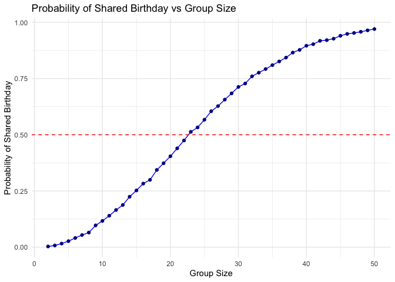

hw5_vy2196
================

``` r
library(tidyverse)
```

    ## ── Attaching core tidyverse packages ──────────────────────── tidyverse 2.0.0 ──
    ## ✔ dplyr     1.1.4     ✔ readr     2.1.5
    ## ✔ forcats   1.0.1     ✔ stringr   1.5.1
    ## ✔ ggplot2   3.5.2     ✔ tibble    3.3.0
    ## ✔ lubridate 1.9.4     ✔ tidyr     1.3.1
    ## ✔ purrr     1.1.0     
    ## ── Conflicts ────────────────────────────────────────── tidyverse_conflicts() ──
    ## ✖ dplyr::filter() masks stats::filter()
    ## ✖ dplyr::lag()    masks stats::lag()
    ## ℹ Use the conflicted package (<http://conflicted.r-lib.org/>) to force all conflicts to become errors

``` r
library(rvest)
```

    ## 
    ## Attaching package: 'rvest'
    ## 
    ## The following object is masked from 'package:readr':
    ## 
    ##     guess_encoding

### Problem 1

``` r
# Function to check if at least two people share a birthday
share_birthday = function(n) {
  birthdays = sample(1:365, n, replace = TRUE)  # randomly assign birthdays
  return(length(unique(birthdays)) < n)          
}

set.seed(1)
n_sim = 10000 # number of simulations per group size

group_sizes = 2:50
prob_shared = numeric(length(group_sizes))

for (i in seq_along(group_sizes)) {
  n = group_sizes[i]
  results = replicate(n_sim, share_birthday(n))
  prob_shared[i] = mean(results)   # proportion of TRUE results
}
```

``` r
#making a plot
sim_results = tibble(
  n = 2:50,
  prob = map_dbl(n, ~ mean(replicate(10000, share_birthday(.x))))
)

ggplot(sim_results, aes(x = n, y = prob)) +
  geom_line(color = "blue") +
  geom_point(color = "darkblue") +
  geom_hline(yintercept = 0.5, linetype = "dashed", color = "red") +
  labs(title = "Probability of Shared Birthday vs Group Size",
       x = "Group Size",
       y = "Probability of Shared Birthday") +
  theme_minimal()
```

<!-- --> The
probability is around 50% when the group size is about 23 people, and it
reaches 100% when the group size is about 50 people.
